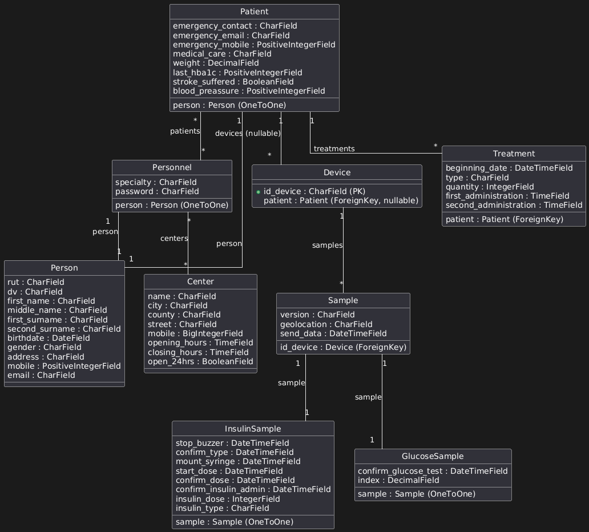

# SART Backend

This is the backend for the SART project, built using Django and Django REST Framework. It provides APIs for managing samples, personnel, patients, centers, and devices.

## Features
- CRUD operations for samples, personnel, patients, centers, and devices.
- Authentication for personnel.
- Relationships between personnel, patients, and centers.
- MySQL database integration.
- Dockerized environment for easy deployment.

---

## Requirements
- Python 3.13
- Docker and Docker Compose
- MySQL

---

## Setup Instructions

### 1. Clone the Repository
```bash
git clone <repository-url>
cd sart_backend
```

### 2. Set Up Environment Variables
Create a `.env` file in the root directory with the following variables:
```env
SECRET_KEY=your-secret-key
DEBUG=True
DJANGO_ALLOWED_HOSTS=localhost
DB_NAME=sart
DB_USER=root
DB_PASSWORD=sart
DB_HOST=database
```

### 3. Install Dependencies
If running locally without Docker:
```bash
pip install -r requirements.txt
```

### 4. Run Migrations
```bash
python manage.py makemigrations
python manage.py migrate
```

### 5. Run the Development Server
```bash
python manage.py runserver
```

---

## Running with Docker

### 1. Build and Start Containers
```bash
docker-compose up --build
```

### 2. Access the Application
- API: `http://localhost:8000`
- MySQL: `localhost:3306` (username: `root`, password: `sart`)

---

## API Endpoints

### Samples
- **POST** `/sample/create/` - Create a new sample.
- **GET** `/sample/dummy/last/` - Get the latest sample.

### Centers
- **POST** `/center/create/` - Create a new center.
- **GET** `/center/getall/` - List all centers.

### Personnel
- **POST** `/personnel/create/` - Create a new personnel.
- **GET** `/personnel/getall/` - List all personnel.
- **POST** `/personnel/login/` - Login for personnel.
- **GET** `/personnel/center/<center_id>/` - List personnel by center.

### Patients
- **POST** `/patient/create/` - Create a new patient.
- **GET** `/patient/getall/` - List all patients.
- **GET** `/patient/personnel/<personnel_id>/` - List patients by personnel.

### Devices
- **POST** `/device/create/` - Create a new device.

---

## Database

The project uses MySQL as the database. Below is an overview of the database schema:

### Schema Overview
The database includes the following key tables:
- **Sample**: Stores information about samples, including version, device, geolocation, and timestamps.
- **InsulinSample**: Stores insulin-related data linked to a sample.
- **GlucoseSample**: Stores glucose-related data linked to a sample.
- **Device**: Represents devices assigned to patients.
- **Center**: Represents medical centers.
- **Personnel**: Stores information about medical personnel, linked to centers and patients.
- **Patient**: Stores patient information, including emergency contacts and medical details.
- **Person**: A base table for storing personal information shared by personnel and patients.

### Schema Diagram
The database schema diagram is located in the `docs` folder. Below is a preview:



To view the full diagram, open the `docs/Database.png` file.

---

## Deployment
For production, ensure the following:
1. Set `DEBUG=False` in the `.env` file.
2. Configure `ALLOWED_HOSTS` with your domain.
3. Use a production-ready WSGI server like Gunicorn.
4. Use the provided `nginx/default.conf` for reverse proxy setup.

---

## Testing
Run tests using:
```bash
python manage.py test
```

---

## Troubleshooting
- Ensure Docker is running if using Docker Compose.
- Check `.env` variables for correct database credentials.
- Use `docker logs <container_name>` to debug container issues.

---

## Postman Collections and Environment Variables

### 1. Import Postman Collections
The `docs` folder contains Postman collections for testing the API. To import them:
1. Open Postman.
2. Click on "Import" in the top-left corner.
3. Select the `.json` file located in the `docs` folder (e.g., `SART_API_Collection.json`).
4. Click "Import" to load the collection.

### 2. Import Postman Environment Variables
The `docs` folder also contains a Postman environment file for setting up variables like base URLs. To import it:
1. Open Postman.
2. Go to "Environments" in the settings menu.
3. Click "Import" and select the `.json` file (e.g., `SART_API_Environment.json`) from the `docs` folder.
4. Click "Import" to load the environment.

### 3. Set the Active Environment
1. After importing the environment, go to the top-right corner of Postman.
2. Select the imported environment from the dropdown menu.
3. Ensure the base URL and other variables are correctly set.

---

## GitHub Workflow and Gitflow

### GitHub Workflow
This project uses a GitHub Actions workflow to validate the Docker Compose setup. The workflow is defined in `.github/workflows/run_check.yml` and is triggered on pull requests targeting the `develop` or `main` branches. 

#### Key Steps in the Workflow:
1. **Checkout Code**: The workflow checks out the code from the repository.
2. **Build and Run Docker Compose**: It builds and starts the Docker Compose services in detached mode using the `prod` profile.
3. **Service Validation**: The workflow waits for the services to start and checks their status. If any container exits unexpectedly, the logs are displayed for debugging.
4. **Cleanup**: After validation, the workflow stops and removes the Docker Compose services to clean up the environment.

This ensures that the Docker Compose setup is functional and ready for deployment.

### Gitflow and Pull Requests
The project follows the Gitflow branching model:
- **Main Branch**: Contains the production-ready code.
- **Develop Branch**: Used for integrating features and preparing for the next release.
- **Feature Branches**: Created for individual features or tasks. These branches are merged into `develop` via pull requests.
- **Hotfix Branches**: Used for urgent fixes in the `main` branch.

#### Pull Request Workflow:
1. Create a feature or hotfix branch from `develop` or `main`.
2. Push your changes and open a pull request targeting the appropriate branch (`develop` or `main`).
3. The GitHub Actions workflow will automatically validate the changes.
4. Once approved, the pull request is merged into the target branch.

This structure ensures a clean and organized development process while maintaining code quality and stability.

---

## Contributors
- Gabriel Gallardo R. (Doe)
